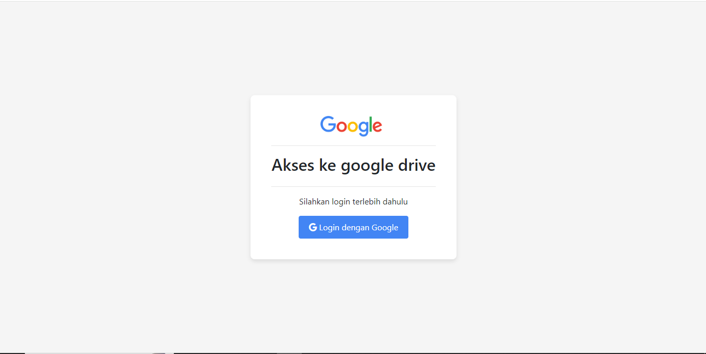
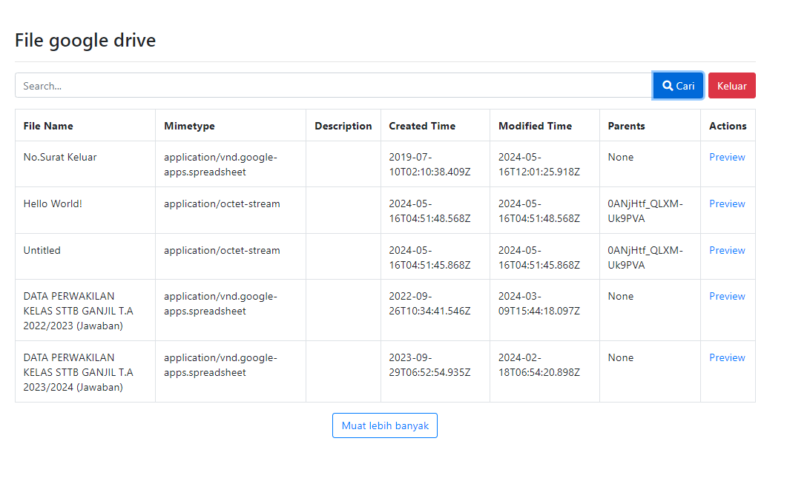

# Google Drive Uploader
Repo ini digunakan untuk uji coba API Google Service.

## Preview Aplikasi
Aplikasi ini digunakan untuk melakukan pengambilan data file dari Google Drive.
Aplikasi ini dibuat sesuai dengan arahan dari dokumen asli: [Google API PHP Client](https://github.com/googleapis/google-api-php-client).

### Halaman Login

### Halaman Beranda / Home
Menampilkan daftar file yang ada di Google Drive.

### Author
- Aziz Arif Rizaldi
- scola.id - 2024